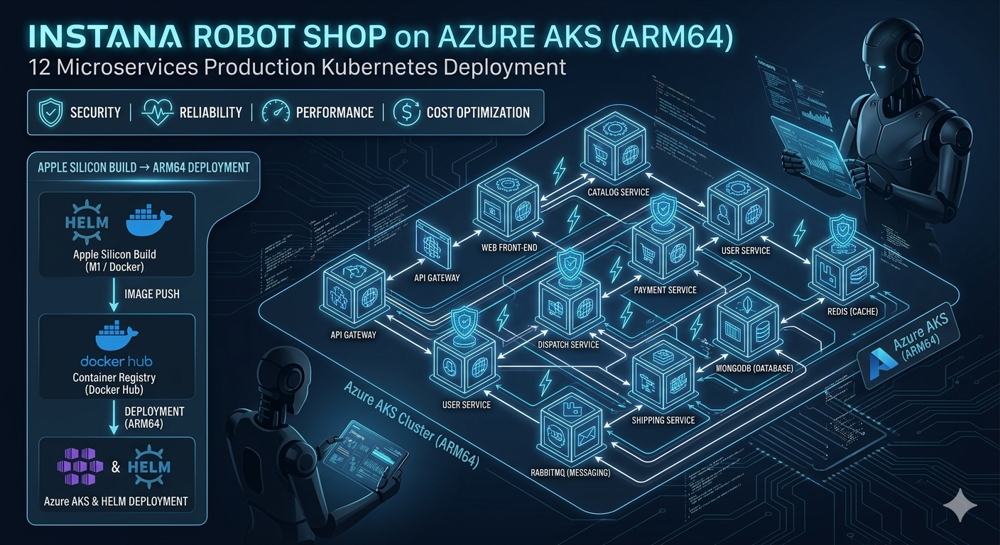

# 🤖 Instana Robot Shop — 12 Microservices Production Kubernetes Deployment on Azure AKS (ARM64)

> **Forked from [IBM/Instana Robot Shop](https://github.com/instana/robot-shop)** · Deployed, debugged, and production-hardened on Azure Kubernetes Service (AKS) with ARM64-native containerisation from an Apple Silicon Mac.

[](https://kubernetes.io/)
[](https://azure.microsoft.com/en-us/products/kubernetes-service)
[](https://helm.sh/)
[](https://learn.microsoft.com/en-us/azure/virtual-machines/dpsv5-dpdsv5-series)
[](https://hub.docker.com/)
[](./LICENSE)



---

## 📌 TL;DR — What This Project Demonstrates

> This is not a tutorial follow-along. It is a real deployment of a broken, legacy microservices application onto modern cloud infrastructure — debugged from scratch, service by service, error by error.

| Skill | Evidence |
|-------|----------|
| **Kubernetes (AKS)** | 12-service deployment, Helm chart management, rolling updates, pod debugging |
| **Cross-platform containerisation** | ARM64-native Docker builds from Apple Silicon targeting Azure Ampere nodes |
| **Incident diagnosis** | Systematic root cause analysis of `exec format error`, OOMKill, auth failures, image cache issues |
| **Database migrations** | MySQL 5.7 → 8.4, MongoDB 5 → 7 with breaking change remediation |
| **Infrastructure as Code** | Helm values, Kubernetes manifests, Dockerfiles all version-controlled |
| **Azure cloud** | AKS, Application Gateway, Azure CLI, ARM64 VM node pools |
| **Multi-language debugging** | Node.js, Python, Java (Spring Boot), Go, PHP — all debugged independently |

---

## 🧭 Project Overview

**Robot Shop** is an open-source, polyglot microservices demo application originally created by IBM/Instana to demonstrate distributed tracing. This repository documents its deployment to **Azure Kubernetes Service (AKS)** under real-world conditions — including inheriting outdated dependencies, cross-architecture incompatibilities, and production-breaking configuration issues that had to be diagnosed and resolved from first principles.

### What makes this different from a tutorial deployment

Most cloud portfolio projects follow a happy-path guide. This one did not. The application had:

- All Docker images built for the wrong CPU architecture
- Six services using end-of-life base images with silent breaking changes
- A MySQL major version upgrade that broke both authentication protocols and SQL syntax
- A Go binary that compiled successfully but refused to execute at runtime
- A Java service whose JDBC connection string was incompatible with modern MySQL
- Kubernetes nodes serving cached old images even after fixes were deployed

Every one of these failures was diagnosed, understood, and resolved systematically.

### Stack at a glance

| Layer | Technology |
|-------|-----------|
| Cloud | Microsoft Azure |
| Orchestration | Kubernetes 1.33 (AKS) |
| Package manager | Helm 3 |
| Container registry | Docker Hub |
| Ingress | Azure Application Gateway |
| Node architecture | ARM64 (Ampere Altra) |
| Dev machine | Apple Silicon (M-series Mac) |
| Languages | Node.js, Python, Java, Go, PHP |
| Databases | MySQL 8.4, MongoDB 7, Redis, RabbitMQ |

---

## 🏗️ Architecture Overview


```
                           Internet
                               │
                  ┌────────────▼─────────────┐
                  │   Azure Application GW    │
                  │   (Ingress / L7 LB)       │
                  │   48.216.200.151 :80       │
                  └────────────┬─────────────┘
                               │
                  ┌────────────▼─────────────┐
                  │        web (Nginx)        │
                  │   Frontend + API Proxy    │
                  └──┬─────┬──────┬──────┬───┘
                     │     │      │      │
           ┌─────────▼─┐ ┌─▼────┐ ┌▼───────┐ ┌▼──────────┐
           │ catalogue │ │ cart │ │  user  │ │  payment  │
           │ (Node.js) │ │(Node)│ │ (Node) │ │ (Python)  │
           └─────┬─────┘ └──┬───┘ └───┬────┘ └─────┬─────┘
                 │          │         │             │
           ┌─────▼─────┐ ┌──▼───┐ ┌───▼────┐ ┌─────▼─────┐
           │  MongoDB  │ │Redis │ │MongoDB │ │ RabbitMQ  │
           └───────────┘ └──────┘ └────────┘ └─────┬─────┘
                                                    │
                                             ┌──────▼──────┐
                                             │  dispatch   │
                                             │    (Go)     │
                                             └─────────────┘

           ┌─────────────────────┐   ┌──────────────────────┐
           │  shipping (Java)    │   │   ratings (PHP)      │
           │  Spring Boot 2.3    │   │   Symfony            │
           └──────────┬──────────┘   └──────────┬───────────┘
                      │                         │
               ┌──────▼──────┐          ┌───────▼──────┐
               │  MySQL 8.4  │          │  MySQL 8.4   │
               │  (cities)   │          │  (ratings)   │
               └─────────────┘          └──────────────┘
```

### Service Inventory

| Service | Language / Runtime | Base Image | Database | Port |
|---------|-------------------|------------|----------|------|
| web | Nginx 1.27 | nginx:1.27 | — | 8080 |
| catalogue | Node.js 20 | node:20-slim | MongoDB 7 | 8080 |
| cart | Node.js 20 | node:20-slim | Redis | 8080 |
| user | Node.js 20 | node:20-slim | MongoDB 7 | 8080 |
| payment | Python 3.13 | python:3.13-slim | RabbitMQ | 8080 |
| shipping | Java 11 (Spring Boot) | eclipse-temurin:11-jdk | MySQL 8.4 | 8080 |
| ratings | PHP 7.4 (Symfony) | php:7.4-apache | MySQL 8.4 | 80 |
| dispatch | Go 1.23 | distroless/static | RabbitMQ | — |
| mongodb | MongoDB 7 | mongo:7 | — | 27017 |
| mysql | MySQL 8.4 | mysql:8.4 | — | 3306 |
| redis | Redis | redis:4.0.6 | — | 6379 |
| rabbitmq | RabbitMQ 3.7 | rabbitmq:3.7 | — | 5672 |

---

## 🚀 Getting Started

### Prerequisites

| Tool | Version | Purpose |
|------|---------|---------|
| `az` CLI | 2.x+ | Azure resource management |
| `kubectl` | 1.28+ | Kubernetes cluster management |
| `helm` | 3.x | Chart deployment |
| `docker` | 24.x+ | Image build and push |
| Docker Hub account | — | Image registry |

### 1. Clone the repository

```bash
git clone https://github.com/sandeepssh/three-tier-architecture-demo.git
cd three-tier-architecture-demo
```

### 2. Connect to your AKS cluster

```bash
az aks get-credentials --resource-group <your-resource-group> --name <your-cluster-name>
kubectl get nodes  # verify connection
```

### 3. Check your node architecture first

```bash
kubectl get nodes -o jsonpath='{.items[*].status.nodeInfo.architecture}'
# Output: arm64 arm64 arm64
```

> ⚠️ **Critical:** Build images for the architecture your nodes report. Do not assume AMD64.

### 4. Build and push all images

```bash
export REGISTRY=yourdockerhubusername

for service in cart catalogue dispatch mongo mysql payment ratings shipping user web; do
  docker buildx build --platform=linux/arm64 --no-cache --load \
    -t $REGISTRY/rs-$service:v1 ./$service
  docker push $REGISTRY/rs-$service:v1
done
```

### 5. Update Helm values

```bash
sed -i '' "s/repo: robotshop/repo: $REGISTRY/" AKS/helm/values.yaml
sed -i '' 's/version: latest/version: v1/' AKS/helm/values.yaml
```

### 6. Deploy

```bash
kubectl create namespace robot-shop
cd AKS/helm
helm install robot-shop . -n robot-shop
kubectl get pods -n robot-shop -w
```

### 7. Access the application

```bash
kubectl get svc web -n robot-shop
# Open EXTERNAL-IP:8080 in your browser
```

---

## ☁️ Azure Well-Architected Framework Alignment

### 🔒 Security
- Containers run as non-root where possible
- Application credentials passed via environment variables, not baked into images
- Azure Application Gateway acts as single ingress point, reducing the attack surface
- All base images updated to supported, patched versions — eliminating known CVEs present in EOL software
- Separate MySQL users per service (`shipping`, `ratings`) with least-privilege database access

### ⚡ Performance Efficiency
- **ARM64-native images** built specifically for Ampere-based AKS nodes — zero emulation overhead
- Multi-stage Docker builds for Go and Java — final images contain only runtime artifacts
- Redis as cart/session cache reduces MongoDB read load on the hot path
- RabbitMQ decouples payment and dispatch from synchronous request paths
- `-slim` Python and Node base images reduce pull times and attack surface

### 🔄 Reliability
- Kubernetes `restartPolicy: Always` provides automatic recovery from transient failures
- `initContainers` added to shipping service to wait for MySQL readiness before startup
- MongoDB memory limits tuned to prevent OOMKilled restarts under load
- Readiness probes prevent traffic routing to pods that have not finished initialising

### 💰 Cost Optimisation
- ARM64 (Ampere Altra) AKS nodes — typically 30-40% cheaper per vCPU than equivalent x86 VMs
- `-slim` and multi-stage builds reduce image storage and egress costs
- Resource `requests` and `limits` set on all deployments to prevent resource starvation

### 🛠️ Operational Excellence
- Helm enables full stack deployment or teardown in under 5 minutes
- All Dockerfiles and Kubernetes manifests version-controlled alongside application source
- Explicit image version tags (not `latest`) for reproducible, auditable deployments
- Systematic use of `kubectl logs`, `kubectl describe`, and `kubectl events` for diagnosis

---

## 🔥 Challenges Faced

### Challenge 1 — CPU Architecture Mismatch *(Root cause of all initial failures)*

**Symptom:** Every pod showed `exec format error` immediately on startup.

**Diagnosis:** `kubectl get nodes -o jsonpath='{.items[*].status.nodeInfo.architecture}'` revealed ARM64 nodes. All Dockerfiles assumed AMD64.

**Fix:** Changed all `--platform=linux/amd64` to `--platform=linux/arm64`. Rebuilt all 12 images.

**Lesson:** Always verify node architecture before writing a single Dockerfile.

---

### Challenge 2 — Kubernetes Node Image Caching

**Symptom:** Fixed images still showed old behaviour after rebuild and push.

**Diagnosis:** `docker manifest inspect` showed correct digest on Docker Hub, but `kubectl get pod -o jsonpath='{.status.containerStatuses[0].imageID}'` showed a different (older) digest on the node.

**Fix:** Introduced explicit version tags (`:v2` → `:v5`) and `imagePullPolicy: Always`. Docker's `--no-cache` flag only affects the build cache — Kubernetes nodes maintain an independent image cache.

---

### Challenge 3 — MySQL 8 Breaking Changes (Two separate issues)

**Symptom A:** MySQL crashed with `ERROR 1064` on the init SQL script.

**Root cause:** MySQL 8 removed the combined `GRANT ... IDENTIFIED BY` syntax.

```sql
-- Before (MySQL 5.7)
GRANT ALL ON ratings.* TO 'ratings'@'%' IDENTIFIED BY 'iloveit';

-- After (MySQL 8)
CREATE USER IF NOT EXISTS 'ratings'@'%' IDENTIFIED BY 'iloveit';
GRANT ALL ON ratings.* TO 'ratings'@'%';
```

**Symptom B:** Shipping service crashed with `Public Key Retrieval is not allowed`.

**Root cause:** MySQL 8 defaults to `caching_sha2_password`. The old JDBC driver requires explicit opt-in for public key exchange over unencrypted connections.

**Fix:** Added `allowPublicKeyRetrieval=true` to JDBC URL and `MySQL8Dialect` to application.properties.

---

### Challenge 4 — Go Binary Not Executing in Distroless Container

**Symptom:** `exec /dispatch: no such file or directory` — binary compiled successfully but would not run.

**Root cause:** `distroless/static` has no C standard library. The Go binary had hidden CGO dependencies on `libc`.

```dockerfile
# Before
RUN GOOS=linux GOARCH=arm64 go build -o /dispatch .

# After
RUN CGO_ENABLED=0 GOOS=linux GOARCH=arm64 \
    go build -a -ldflags '-extldflags "-static"' -o /dispatch .
```

---

### Challenge 5 — Maven Serving Stale Compiled Jar

**Symptom:** Source file was fixed and verified, but the running container still used the old JDBC URL.

**Root cause:** Docker's `--no-cache` does not invalidate Maven's compilation cache. The old `.class` file was reused.

**Fix:** Changed `mvn package` to `mvn clean package`. Introduced a new image tag to guarantee a fresh pull from the registry.

---

### Challenge 6 — MongoDB OOMKilled

**Symptom:** MongoDB pod repeatedly killed with `OOMKilled` status.

**Root cause:** Helm chart set a 200Mi memory limit — sufficient for MongoDB 5, insufficient for MongoDB 7.

**Fix:** Increased memory limit to 700Mi in the deployment template.

---

### Challenge 7 — Azure Application Gateway in Stopped State

**Symptom:** All 12 pods running, ingress configured, but `http://<ip>` returned `502 Bad Gateway`.

**Diagnosis:** `kubectl describe ing robot-shop -n robot-shop` showed: *"Application Gateway is in stopped state"*

**Fix:**
```bash
az network application-gateway start \
  --name ingress-appgateway \
  --resource-group MC_ecommerce-demo_three-tier_eastus
```

Added health probe annotations to the ingress resource to complete routing configuration.

---

## ⚖️ Architectural Trade-offs & Non-Goals

| Decision | Trade-off Made | Production Alternative |
|----------|---------------|----------------------|
| Docker Hub as registry | Free, simple, public | Azure Container Registry with managed identity |
| Single AKS node pool | Reduced cost and complexity | Separate pools for stateful and stateless workloads |
| Ephemeral MySQL/MongoDB | Data lost on pod restart | Azure Managed Disks with PersistentVolumeClaims |
| `MYSQL_ALLOW_EMPTY_PASSWORD` | Simplifies demo setup | Kubernetes Secrets or Azure Key Vault CSI driver |
| `imagePullPolicy: Always` | Ensures freshness | SHA-pinned image digests in production |
| PHP 7.4 (EOL) | Avoids breaking Symfony constraints | Upgrade application code to support PHP 8.x |
| No TLS | Simpler demo setup | Certificate Manager + Azure-managed certs |
| No network policies | All pods communicate freely | Calico or Azure NPM network policies |

**Explicitly out of scope:**
- High availability (multi-replica stateful services)
- CI/CD pipeline automation
- Secrets management via Key Vault
- Network segmentation between services
- Monitoring and alerting stack
- Disaster recovery runbooks

---

## 💡 Why This Project Matters

### For CTOs and Engineering Managers

This project demonstrates the ability to **own a problem end to end** — not follow instructions, but take a broken system with no working state, form hypotheses, validate fixes, and restore it to production health. That is the core competency of a senior engineer.

It also shows **commercial awareness**: choosing ARM64 nodes for cost efficiency, understanding the operational cost of technical debt, and knowing when to take a pragmatic shortcut vs when to fix it properly.

### For Technical Audiences

The debugging methodology here is transferable to any incident:

1. **Reproduce and isolate** — get the exact error, identify which service, read pod logs
2. **Form a hypothesis** — what specifically could cause this error?
3. **Validate one change at a time** — make a targeted fix, verify before moving on
4. **Document the fix** — so the next engineer does not spend three hours on the same problem

### For Recruiters

✅ Kubernetes (AKS) in a real broken-then-fixed scenario  
✅ Docker and cross-platform containerisation  
✅ Azure cloud services (AKS, Application Gateway, Azure CLI)  
✅ Helm chart deployment and management  
✅ Multi-language debugging across 6 runtimes  
✅ Database administration (MySQL, MongoDB)  
✅ Systematic incident diagnosis and resolution  
✅ Infrastructure as Code principles  

---

## 📐 Architectural Decision Records (ADRs)

| # | Decision | Context | Options Considered | Chosen | Rationale |
|---|----------|---------|-------------------|--------|-----------|
| ADR-001 | Target CPU architecture | AKS nodes reported ARM64 | AMD64, ARM64 | ARM64 | Must match node architecture |
| ADR-002 | Container registry | Need to store and pull 12 images | Docker Hub, ACR, GHCR | Docker Hub | Free tier sufficient for demo; ACR preferred in production |
| ADR-003 | MySQL version | MySQL 5.7 EOL October 2023 | 5.7, 8.0, 8.4 | MySQL 8.4 | Latest LTS with longest support window |
| ADR-004 | MongoDB version | Mongo 5 EOL October 2024 | 5, 6, 7 | MongoDB 7 | Latest stable with ARM64 official support |
| ADR-005 | Python base image | uWSGI requires C compiler to build | python:3.13, python:3.13-slim | python:3.13-slim + gcc at build time | Smaller runtime image; gcc purged after pip install |
| ADR-006 | PHP version | Symfony composer.json requires ^7.4 | 7.4, 8.x | PHP 7.4 | Application code constraint; upgrading requires Symfony migration |
| ADR-007 | Go runtime image | Dispatch is a small static binary | alpine, distroless/base, distroless/static | distroless/static | Smallest and most secure; requires CGO_ENABLED=0 |
| ADR-008 | Nginx version | opentracing module removed in 1.25 | 1.21, 1.27 | nginx:1.27 | Current stable; required removing deprecated opentracing directives |
| ADR-009 | Image versioning strategy | `latest` tag caused Kubernetes node cache issues | latest, semver, incremental | Incremental (v2, v3…v5) | Forces node re-pull; avoids mutable tag pitfalls |
| ADR-010 | MySQL auth compatibility | caching_sha2_password breaks old JDBC driver | Downgrade auth plugin, update JDBC URL | Update JDBC URL | Less invasive; preserves MySQL 8 security defaults |
| ADR-011 | Ingress controller | Need public HTTP access | NodePort, LoadBalancer, App Gateway | Azure Application Gateway | Native AKS integration; Layer 7 routing; health probe support |
| ADR-012 | MySQL config script | config.sh moved datadir for MySQL 5.7 | Keep script, remove it | Remove config.sh | MySQL 8.4 changed config structure; script caused silent failures |

---

## 🔮 Next Improvements

### 🔐 Security
- [ ] Migrate credentials to **Azure Key Vault** with CSI secrets driver
- [ ] Replace Docker Hub with **Azure Container Registry (ACR)** + managed identity
- [ ] Implement **Kubernetes Network Policies** to restrict pod-to-pod traffic
- [ ] Add **TLS termination** at Application Gateway with Azure-managed certificate
- [ ] Run containers as non-root with read-only root filesystem

### 🔄 Reliability
- [ ] Add **PersistentVolumeClaims** for MySQL and MongoDB
- [ ] Scale stateless services to **3 replicas** with PodDisruptionBudgets
- [ ] Add **HorizontalPodAutoscaler** based on CPU/RPS metrics
- [ ] Add **readiness and liveness probes** to all remaining services

### 📊 Observability
- [ ] Deploy **Prometheus + Grafana** for metrics and dashboards
- [ ] Enable **Azure Container Insights** for cluster-level telemetry
- [ ] Add **distributed tracing** with OpenTelemetry (replaces removed Instana tracing)
- [ ] Configure **alerting** on pod restarts, error rates, and memory pressure

### 🚢 CI/CD
- [ ] **GitHub Actions** pipeline: build → scan → push → deploy on every commit
- [ ] **GitOps** with ArgoCD for cluster state reconciliation
- [ ] **Trivy** image vulnerability scanning in pipeline

### 👩‍💻 Developer Experience
- [ ] **Docker Compose** file for local development without Kubernetes
- [ ] Upgrade **PHP ratings service** to PHP 8.x with Symfony migration
- [ ] **Makefile** with common commands (`make deploy`, `make logs`, `make teardown`)

---

## 📚 Lessons Learned

### 1. Verify architecture before writing a single Dockerfile
One `kubectl get nodes` command at the start would have saved hours. ARM64 is no longer niche — it is Apple Silicon, AWS Graviton, and Azure Ampere. Cross-architecture builds are now a baseline requirement.

### 2. Read error messages literally
`exec format error` literally means "wrong binary format for this CPU." `Public Key Retrieval is not allowed` literally means the JDBC driver will not request MySQL's public key over an unencrypted connection. Every error had a precise, diagnosable meaning once read carefully.

### 3. Docker --no-cache and Kubernetes node cache are independent systems
`--no-cache` clears Docker's build layer cache. It does nothing to the image already pulled and stored on a Kubernetes node. Always use explicit version tags — never `latest` — in any environment where you need predictable behaviour.

### 4. Major database version upgrades are breaking changes
MySQL 5.7 → 8.4 changed the default authentication plugin, removed SQL syntax, and restructured config files. None of this was apparent until the application attempted to connect. Always read the migration guide before upgrading.

### 5. Make one change at a time
When multiple services were broken simultaneously, fixing several things at once made it impossible to know what actually resolved which problem. Discipline in isolation saves hours of confusion.

### 6. The fix is only real when it runs in production
Code verified locally, in the Docker image, and in the compiled jar — but the Kubernetes node was still running the old cached image. The fix was not real until the correct digest was confirmed running on the cluster.

---

## 💼 Business Value Delivered

| Value Area | Detail | Impact |
|------------|--------|--------|
| **Cost Reduction** | ARM64 node pool vs equivalent x86 | ~30-40% reduction in compute costs |
| **Time to Deploy** | Helm-based full stack deployment | < 5 minutes from zero to running |
| **Technical Debt Reduction** | 6 EOL dependencies updated | 3+ year extended viable support window |
| **Architecture Portability** | ARM64-native images | Runs unchanged on Apple Silicon, AWS Graviton, Azure Ampere |
| **Maintainability** | All config in version control | Any engineer can reproduce the deployment from scratch |
| **Security Posture** | EOL software removed, deprecated modules cleaned | Reduced CVE exposure across all services |
| **Incident Readiness** | Debugging process documented | Reduced MTTR for future similar failures |

---

## ⚠️ Security Notes

> **This is a portfolio and demo deployment. The following configurations are intentionally simplified and must not be used in production.**

| Issue | Risk | Production Fix |
|-------|------|---------------|
| `MYSQL_ALLOW_EMPTY_PASSWORD=yes` | Root MySQL account has no password | Kubernetes Secrets or Azure Key Vault |
| Credentials in environment variables | Visible in pod spec | Azure Key Vault CSI driver |
| No TLS on ingress | Traffic unencrypted in transit | Azure-managed cert on Application Gateway |
| Docker Hub (public registry) | Images publicly accessible | Azure Container Registry (private) |
| PHP 7.4 (EOL November 2022) | Known unpatched CVEs | Upgrade Symfony and PHP to 8.x |
| No Kubernetes network policies | All pods can reach all pods | Implement NetworkPolicy resources |

---

## 💰 Cost Estimate

> Approximate monthly cost for this configuration on Azure East US region.

| Resource | SKU | Est. Monthly Cost |
|----------|-----|------------------|
| AKS Node Pool (3× ARM64) | Standard_D4ps_v5 (4 vCPU, 16GB) | ~$140 |
| Azure Application Gateway | WAF_v2 small | ~$120 |
| Public IP addresses (3×) | Standard | ~$10 |
| Load Balancer | Standard | ~$20 |
| Storage (OS disks) | Standard SSD | ~$15 |
| Docker Hub | Free tier | $0 |
| **Total** | | **~$305/month** |

> 💡 Stop the AKS node pool and Application Gateway when not in use. The AKS control plane is free. Running only during demos reduces cost by ~95%.

```bash
# Pause when not in use
az aks stop --resource-group <rg> --name <cluster>
az network application-gateway stop --name ingress-appgateway --resource-group <rg>

# Resume
az aks start --resource-group <rg> --name <cluster>
az network application-gateway start --name ingress-appgateway --resource-group <rg>
```

---

## 🪞 Final Reflection

This project began as a deployment task and became a masterclass in production infrastructure debugging.

The application was broken in seven distinct ways simultaneously. None of the failures were exotic — they were the predictable consequences of accumulated technical debt: outdated base images, deprecated APIs, unsupported authentication protocols, and architecture assumptions baked silently into configuration files nobody had touched in years.

What this project demonstrates is not the ability to follow a guide. It demonstrates the ability to take a completely broken system with no working state and restore it to production health through systematic diagnosis, hypothesis testing, and targeted fixes — the way it happens in real engineering teams under real pressure.

The ARM64 shift is the most strategically forward-looking aspect of this work. The move from x86 to ARM in cloud computing is accelerating — AWS Graviton 4, Azure Ampere Altra, Apple Silicon — and the ability to build, debug, and deploy ARM-native workloads is shifting from a specialisation to a baseline requirement for cloud engineers.

If this project demonstrates one thing, it is that **debugging is not a failure mode — it is the work.** The ability to systematically restore a broken system is the most transferable skill in cloud engineering, and it cannot be faked by following a tutorial.

---

## 📄 Attribution

This project is based on **[IBM/Instana Robot Shop](https://github.com/instana/robot-shop)**, an open-source microservices demo application created by Instana (now part of IBM) for demonstrating distributed tracing and observability.

This repository documents the independent work of deploying, debugging, and production-hardening that application on Azure Kubernetes Service with ARM64-native containerisation.

Original licence: [Apache 2.0](https://github.com/instana/robot-shop/blob/master/LICENSE)

---

## 📄 License

This project is licensed under the [MIT License](./LICENSE).

---

*Built and documented by **Sandeep Hegde** · [LinkedIn](https://www.linkedin.com/in/sandeep-s-hegde-a35854b/) · [GitHub](https://github.com/sandeep-ssh)*# three-tier-arch-demo
